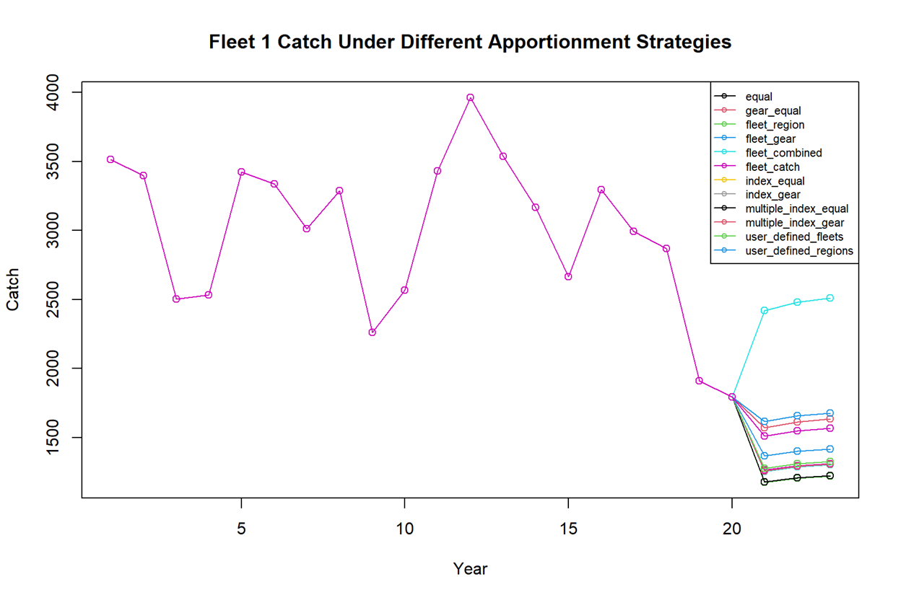
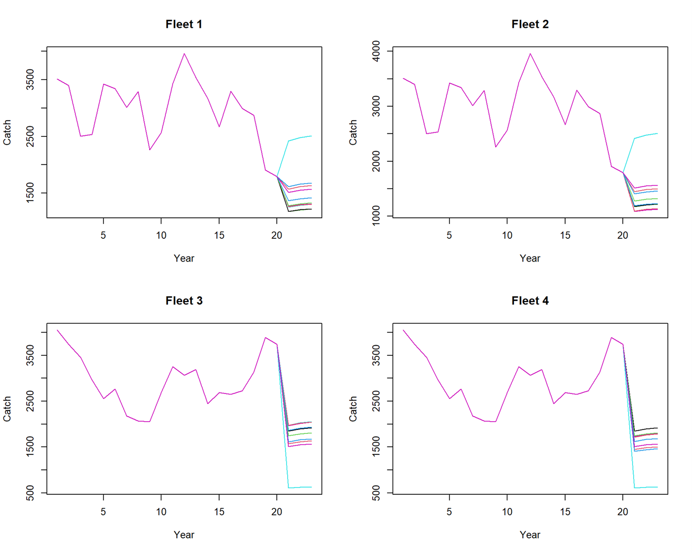
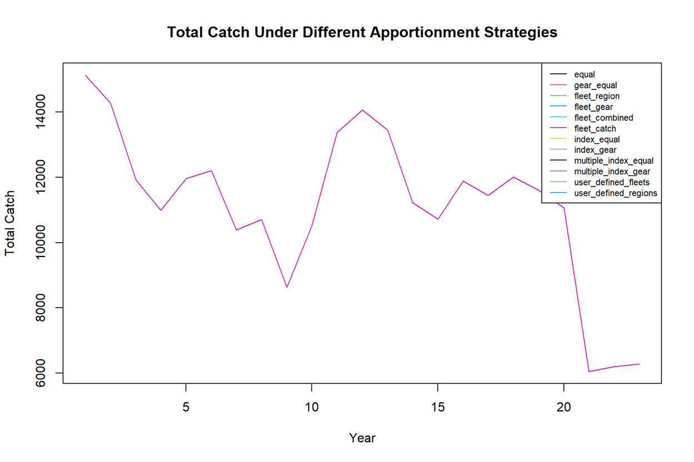

This vignette demonstrates how to specify and compare **catch
apportionment strategies** when the operating model (OM) is spatially
explicit but the assessment model (EM) is fit as a **panmictic**
(spatially aggregated) model.

In this setting, the EM typically produces catch advice at an aggregated
level, and that advice must then be reallocated back to the original
fleet structure in the OM. The function `calculate_catch_advice()`
supports a range of allocation strategies, including:

- equal allocation
- equal allocation within gear groups
- historical catch-based allocation
- survey index-based allocation
- multiple-survey allocation
- user-defined fleet weights
- user-defined regional weights

This vignette shows how to test all currently available strategies in a
single reproducible workflow and explains the logic behind each
catch apportionment method.

# Catch Apportionment Strategies

When a **panmictic assessment model (EM)** is used to estimate stock
status for an **operating model (OM) that is spatially explicit**, the
catch advice produced by the EM must be redistributed back to the
original fleet structure of the OM. This redistribution process is
referred to as **catch apportionment**.

In this framework, the EM typically estimates a **single total allowable
catch (TAC)** or aggregated fleet catches. Because the OM may contain
multiple fleets operating in different regions or using different gear
types, the TAC must be partitioned across fleets according to a
specified allocation rule.

The `catch_alloc` argument determines how catch advice is distributed
back to fleets. Several allocation strategies are available, each
reflecting different management assumptions.

These strategies can be broadly classified into four categories:

- Equal allocation strategies  
- Catch-based allocation strategies  
- Survey-based allocation strategies  
- User-defined allocation strategies  

Each strategy represents a different way to interpret historical fishing
activity or biological information when distributing catch advice among
fleets.

## 1 Equal Allocation Strategies

Equal allocation strategies assume that all fleets (or fleet groups)
should receive **identical shares of the catch advice**, regardless of
their historical catch levels or spatial differences in abundance.

These strategies are commonly used as baseline scenarios when evaluating
management procedures.

### Method: `equal`

This method assigns **equal weights to all fleets**.

If there are `F` fleets, each fleet receives:

`w_f = 1 / F`

of the total catch advice.

For example, if there are four fleets, each fleet receives **25% of the
total catch advice**.

This approach assumes that fleets are interchangeable and does not rely
on historical catch data or survey information.

### Method: `gear_equal`

This method assigns equal weights **within fleet or gear groups**.

Fleet groups are defined through the `fleet_pointer` structure used in
fleet aggregation. Equal allocation is applied first across groups and
then equally among fleets within each group.

This method reflects a management assumption that fleets within the same
sector or gear category should share catch equally.

## 2 Catch-Based Allocation Strategies

Catch-based allocation strategies use **historical catch information**
from the operating model to determine allocation weights.

These strategies assume that **past fishing behavior provides a
reasonable basis for distributing future catch advice**.

Allocation weights are typically calculated using catch data from the
most recent `weight_years` years.

### Method: `fleet_region`

This strategy allocates catch based on **historical catch totals by
region**.

Steps:

1. Catch is summed for each region across fleets.
2. Regional catch proportions are calculated.
3. Catch advice is distributed among fleets according to those regional
   proportions.

This strategy reflects a management assumption that regions with
historically higher catches should receive larger shares of catch
advice.

### Method: `fleet_gear`

This strategy allocates catch based on **historical catch by fleet
group or gear type**.

Steps:

1. Catch is aggregated by fleet group.
2. Allocation weights are calculated from the proportion of catch
   attributed to each group.
3. Catch advice is distributed across fleets according to these
   proportions.

This approach reflects management systems where **gear sectors receive
catch shares proportional to historical participation**.

### Method: `fleet_combined`

This method calculates weights using **combined catch information across
fleets and regions**.

By combining catch across fleet categories, the method can produce more
stable allocation weights when fleet structures are complex or when
fleets operate in multiple regions.

### Method: `fleet_catch`

This strategy directly allocates catch advice according to
**fleet-specific historical catch proportions**.

If fleet `f` caught `C_f` during the weighting period and total catch
was `C_total`, then the fleet receives:

`w_f = C_f / C_total`

of the catch advice.

This method is commonly used in fisheries management systems that
allocate quotas based on historical catch shares.

## 3 Survey-Based Allocation Strategies

Survey-based allocation strategies distribute catch advice according to
**survey indices of abundance** rather than historical catch.

These strategies assume that **catch should be allocated where fish are
currently most abundant**, as indicated by survey observations.

### Method: `index_equal`

This method uses a **single survey index** to determine regional
abundance and distributes catch equally among fleets within each region.

Steps:

1. The specified survey index (`survey_pointer`) is used to estimate
   regional abundance.
2. Regional weights are calculated from survey values.
3. Catch advice is distributed across fleets according to those
   regional weights.

This approach prioritizes **current biological information rather than
historical fishing patterns**.

### Method: `index_gear`

This method extends the previous approach by incorporating **gear or
fleet structure**.

Steps:

1. Survey data estimate regional abundance.
2. Regional weights are calculated.
3. Catch advice is distributed across fleets within each region
   according to fleet structure.

### Method: `multiple_index_equal`

This strategy uses **multiple survey indices simultaneously** to
estimate regional abundance.

Steps:

1. Multiple surveys specified by `survey_pointer` are used.
2. Survey indices are combined to estimate abundance.
3. Regional weights are calculated.
4. Catch is distributed equally across fleets within each region.

Using multiple surveys can reduce uncertainty when monitoring stock
distribution.

### Method: `multiple_index_gear`

This method combines **multiple survey indices with fleet grouping**.

Regional abundance is estimated using multiple surveys, and catch is
then distributed among fleets according to gear structure within each
region.

## 4 User-Defined Allocation Strategies

User-defined allocation strategies allow analysts to **directly specify
allocation weights** rather than deriving them from historical catch or
survey data.

These strategies are useful when testing alternative management
policies.

### Method: `user_defined_fleets`

Users specify weights for each fleet.

Example:

`user_weights = c(0.4, 0.4, 0.1, 0.1)`

This means:

- Fleet 1 receives 40%
- Fleet 2 receives 40%
- Fleet 3 receives 10%
- Fleet 4 receives 10%

Weights must sum to 1.

This approach is useful for evaluating **quota-share policies**.

### Method: `user_defined_regions`

Users specify weights for each region instead of fleets.

Example:

`user_weights = c(0.5, 0.5)`

This allocates catch equally between two regions. Catch is then
distributed among fleets operating within each region.

This method allows evaluation of **regional allocation policies**.

## Weighting Period

Many allocation strategies use the argument:

`weight_years`

This specifies the number of recent years used to calculate allocation
weights.

Example:

`weight_years = 3`

This means weights are calculated using the **average catch or survey
index values from the most recent three years**.

Using multiple years helps reduce short-term variability and produces
more stable allocation weights.

## Interpretation in Management Strategy Evaluation

Catch apportionment strategies can strongly influence fleet-level
fishing pressure and therefore future stock dynamics.

Different allocation rules may produce:

- different regional fishing mortality patterns
- different fleet catch trajectories
- different stock recovery outcomes

Testing multiple catch apportionment strategies helps evaluate the
**robustness of management advice to allocation assumptions**.

This is particularly important when:

- the operating model includes spatial structure
- fleets operate across multiple regions
- the assessment model is spatially aggregated

Comparing strategies allows analysts to understand how management
decisions regarding quota allocation affect the performance of harvest
control rules and overall stock dynamics.

## 5. Load packages

```{r setup, message=FALSE, warning=FALSE}
library(wham)
library(SPASAM.MSE)
library(here)
```

Set the working directory reference if needed:

```{r}
main.dir <- here::here()
```

## 6. Generate basic information

We first create a simple two-stock, two-region operating model with four
fleets and four indices.

```{r,eval=FALSE}
year_start <- 1
year_end   <- 20
MSE_years  <- 3

info <- generate_basic_info(
  n_stocks = 2,
  n_regions = 2,
  n_indices = 4,
  n_fleets = 4,
  n_seasons = 4,
  base.years = year_start:year_end,
  n_feedback_years = MSE_years,
  life_history = "medium",
  n_ages = 12
)

basic_info <- info$basic_info
catch_info <- info$catch_info
index_info <- info$index_info
F_info     <- info$F
```

## 7. Specify movement

Here we use bidirectional movement between regions.

```{r,eval=FALSE}
basic_info <- generate_NAA_where(
  basic_info = basic_info,
  move.type = 2
)

move <- generate_move(
  basic_info = basic_info,
  move.type = 2,
  move.rate = c(0.2, 0.1),
  move.re = "constant"
)
```

## 8. Configure selectivity and natural mortality

```{r,eval=FALSE}
n_stocks  <- as.integer(basic_info["n_stocks"])
n_regions <- as.integer(basic_info["n_regions"])
n_fleets  <- as.integer(basic_info["n_fleets"])
n_indices <- as.integer(basic_info["n_indices"])
n_ages    <- as.integer(basic_info["n_ages"])

fleet_pars <- c(5, 1)
index_pars <- c(2, 1)

sel <- list(
  model = rep("logistic", n_fleets + n_indices),
  initial_pars = c(
    rep(list(fleet_pars), n_fleets),
    rep(list(index_pars), n_indices)
  )
)

M <- list(
  model = "constant",
  initial_means = array(0.2, dim = c(n_stocks, n_regions, n_ages))
)
```

## 9. Configure numbers-at-age

```{r,eval=FALSE}
sigma      <- "rec+1"
re_cor     <- "iid"
ini.opt    <- "equilibrium"
sigma_vals <- array(0.5, dim = c(n_stocks, n_regions, n_ages))

NAA_re <- list(
  N1_model = rep(ini.opt, n_stocks),
  sigma = rep(sigma, n_stocks),
  cor = rep(re_cor, n_stocks),
  recruit_model = 2,
  sigma_vals = sigma_vals
)
```

## 10. Generate the WHAM input and operating model

```{r,eval=FALSE}
input <- prepare_wham_input(
  basic_info = basic_info,
  selectivity = sel,
  M = M,
  NAA_re = NAA_re,
  move = move,
  catch_info = catch_info,
  index_info = index_info,
  F = F_info
)

random <- input$random
input$random <- NULL

om <- fit_wham(
  input,
  do.fit = FALSE,
  do.brps = TRUE,
  MakeADFun.silent = TRUE
)
```

## 11. Simulate data from the operating model

```{r,eval=FALSE}
om_with_data <- update_om_fn(
  om,
  seed = 123,
  random = random
)
```

## 12. Define assessment years

Here the assessment interval is set to 3 years, matching the feedback
period.

```{r,eval=FALSE}
assess.interval <- 3
base.years      <- year_start:year_end
terminal.year   <- tail(base.years, 1)

assess.years <- seq(
  terminal.year,
  tail(om$years, 1) - assess.interval,
  by = assess.interval
)

assess.years
```

## 13. Define the panmictic assessment model

We now define a simplified panmictic EM with:

- 1 stock
- 1 region
- 2 aggregated fleets
- 2 aggregated survey indices

The aggregated fleet structure is:

- aggregated fleet 1 = original fleets 1 and 3
- aggregated fleet 2 = original fleets 2 and 4

The aggregated survey structure is:

- aggregated index 1 = original indices 1 and 3
- aggregated index 2 = original indices 2 and 4

```{r,eval=FALSE}
n_stocks_em  <- 1
n_regions_em <- 1
n_fleets_em  <- 2
n_indices_em <- 2

sel_em <- list(
  model = rep("logistic", n_fleets_em + n_indices_em),
  initial_pars = c(
    rep(list(fleet_pars), n_fleets_em),
    rep(list(index_pars), n_indices_em)
  )
)

NAA_re_em <- list(
  N1_model = "equilibrium",
  sigma = "rec+1",
  cor = "iid"
)

M_em <- list(
  model = "constant",
  initial_means = array(0.2, dim = c(n_stocks_em, n_regions_em, n_ages))
)

aggregate_catch_info <- list(
  n_fleets = 2,
  fleet_pointer = c(1, 2, 1, 2),
  use_catch_weighted_waa = TRUE,
  catch_Neff = c(100, 100),
  catch_cv = c(0.1, 0.1)
)

aggregate_index_info <- list(
  n_indices = 2,
  index_pointer = c(1, 2, 1, 2),
  use_catch_weighted_waa = TRUE,
  index_Neff = c(100, 100),
  index_cv = c(0.1, 0.1)
)

em_opts <- list(
  separate.em = TRUE,
  separate.em.type = 1,
  do.move = FALSE,
  est.move = FALSE
)
```

## 14. Define all available catch apportionment strategies

The current `calculate_catch_advice()` implementation supports the
following methods.

### Equal-weight methods

- `equal`
- `gear_equal`

### Catch-based methods

- `fleet_region`
- `fleet_gear`
- `fleet_combined`
- `fleet_catch`

### Survey-based methods

- `index_equal`
- `index_gear`
- `multiple_index_equal`
- `multiple_index_gear`

### User-defined methods

- `user_defined_fleets`
- `user_defined_regions`

We collect them in a named list.

```{r,eval=FALSE}
catch_alloc_list <- list(
  equal = list(
    weight_type = 1,
    method = "equal",
    weight_years = 3
  ),
  gear_equal = list(
    weight_type = 1,
    method = "gear_equal",
    weight_years = 3
  ),
  fleet_region = list(
    weight_type = 2,
    method = "fleet_region",
    weight_years = 3
  ),
  fleet_gear = list(
    weight_type = 2,
    method = "fleet_gear",
    weight_years = 3
  ),
  fleet_combined = list(
    weight_type = 2,
    method = "fleet_combined",
    weight_years = 3
  ),
  fleet_catch = list(
    weight_type = 2,
    method = "fleet_catch",
    weight_years = 3
  ),
  index_equal = list(
    weight_type = 3,
    method = "index_equal",
    weight_years = 3,
    survey_pointer = 1
  ),
  index_gear = list(
    weight_type = 3,
    method = "index_gear",
    weight_years = 3,
    survey_pointer = 1
  ),
  multiple_index_equal = list(
    weight_type = 3,
    method = "multiple_index_equal",
    weight_years = 3,
    survey_pointer = c(1, 2)
  ),
  multiple_index_gear = list(
    weight_type = 3,
    method = "multiple_index_gear",
    weight_years = 3,
    survey_pointer = c(1, 2)
  ),
  user_defined_fleets = list(
    weight_type = 4,
    method = "user_defined_fleets",
    user_weights = c(0.4, 0.4, 0.1, 0.1)
  ),
  user_defined_regions = list(
    weight_type = 4,
    method = "user_defined_regions",
    user_weights = c(0.5, 0.5)
  )
)

names(catch_alloc_list)
```

## 15. Create a helper function to run one strategy

This helper avoids repeating the same `loop_through_fn()` call for every
allocation method.

```{r,eval=FALSE}
run_one_apportionment <- function(catch_alloc) {
  loop_through_fn(
    om = om_with_data,
    em_info = info,
    random = random,
    M_em = M_em,
    sel_em = sel_em,
    NAA_re_em = NAA_re_em,
    move_em = NULL,
    age_comp_em = "multinomial",
    em.opt = em_opts,
    aggregate_catch_info = aggregate_catch_info,
    aggregate_index_info = aggregate_index_info,
    catch_alloc = catch_alloc,
    assess_years = assess.years,
    assess_interval = assess.interval,
    base_years = base.years,
    year.use = 20,
    seed = 123,
    save.sdrep = TRUE,
    save.last.em = TRUE
  )
}
```

## 16. Run all apportionment strategies

```{r,eval=FALSE}
mod <- lapply(catch_alloc_list, run_one_apportionment)
```

## 17. Inspect catch advice from each strategy

The object `mod` is a named list. Each element contains a full MSE run
under a different apportionment rule.

```{r,eval=FALSE}
names(mod)
```

For example, the first projected fleet-level catch advice matrix from the
`equal` strategy is:

```{r,eval=FALSE}
mod$equal$catch_advice[[1]]
```

And from the `fleet_region` strategy:

```{r,eval=FALSE}
mod$fleet_region$catch_advice[[1]]
```

## 18. Compare realized OM catches among strategies

We extract fleet-specific predicted catches from the updated OM after the
MSE loop.

```{r,eval=FALSE}
fleet_catch_list <- lapply(mod, function(x) x$om$rep$pred_catch)
```

For example, Fleet 1 catch under all strategies:

```{r,eval=FALSE}
fleet1_df <- data.frame(
  Year = seq_len(nrow(fleet_catch_list[[1]])),
  equal = fleet_catch_list$equal[, 1],
  gear_equal = fleet_catch_list$gear_equal[, 1],
  fleet_region = fleet_catch_list$fleet_region[, 1],
  fleet_gear = fleet_catch_list$fleet_gear[, 1],
  fleet_combined = fleet_catch_list$fleet_combined[, 1],
  fleet_catch = fleet_catch_list$fleet_catch[, 1],
  index_equal = fleet_catch_list$index_equal[, 1],
  index_gear = fleet_catch_list$index_gear[, 1],
  multiple_index_equal = fleet_catch_list$multiple_index_equal[, 1],
  multiple_index_gear = fleet_catch_list$multiple_index_gear[, 1],
  user_defined_fleets = fleet_catch_list$user_defined_fleets[, 1],
  user_defined_regions = fleet_catch_list$user_defined_regions[, 1]
)

head(fleet1_df)
```

## 19. Plot Fleet 1 catch across strategies

```{r fig.width=9, fig.height=6, eval=FALSE}
matplot(
  x = fleet1_df$Year,
  y = as.matrix(fleet1_df[, -1]),
  type = "o",
  pch = 1,
  lty = 1,
  xlab = "Year",
  ylab = "Catch",
  main = "Fleet 1 Catch Under Different Apportionment Strategies"
)

legend(
  "topright",
  legend = colnames(fleet1_df)[-1],
  col = seq_len(ncol(fleet1_df) - 1),
  lty = 1,
  pch = 1,
  cex = 0.7
)
```
{width="600"}

## 20. Plot all fleets separately

```{r fig.width=10, fig.height=8, eval=FALSE}
old_par <- par(no.readonly = TRUE)
par(mfrow = c(2, 2))

for (f in 1:4) {
  tmp_df <- data.frame(
    Year = seq_len(nrow(fleet_catch_list[[1]])),
    do.call(
      cbind,
      lapply(fleet_catch_list, function(x) x[, f])
    )
  )

  colnames(tmp_df) <- c("Year", names(fleet_catch_list))

  matplot(
    x = tmp_df$Year,
    y = as.matrix(tmp_df[, -1]),
    type = "l",
    lty = 1,
    xlab = "Year",
    ylab = "Catch",
    main = paste("Fleet", f)
  )
}

par(old_par)
```
{width="600"}

## 21. Compare total catch by strategy

In some applications, it is useful to compare total OM catch across
strategies rather than fleet-specific catch.

```{r, eval=FALSE}
total_catch_df <- data.frame(
  Year = seq_len(nrow(fleet_catch_list[[1]]))
)

for (nm in names(fleet_catch_list)) {
  total_catch_df[[nm]] <- rowSums(fleet_catch_list[[nm]])
}

head(total_catch_df)
```

```{r fig.width=9, fig.height=6, eval=FALSE}
matplot(
  x = total_catch_df$Year,
  y = as.matrix(total_catch_df[, -1]),
  type = "l",
  lty = 1,
  xlab = "Year",
  ylab = "Total Catch",
  main = "Total Catch Under Different Apportionment Strategies"
)

legend(
  "topright",
  legend = colnames(total_catch_df)[-1],
  col = seq_len(ncol(total_catch_df) - 1),
  lty = 1,
  cex = 0.7
)
```
{width="600"}

## 22. Notes on interpretation

The different catch apportionment rules control how aggregate advice from
a panmictic EM is translated back to the fleet structure of the OM.

- `equal` assigns equal weights to all fleets.
- `gear_equal` assigns equal weights within each aggregated fleet group
  defined by `fleet_pointer`.
- `fleet_region`, `fleet_gear`, `fleet_combined`, and `fleet_catch`
  use historical catch information.
- `index_equal`, `index_gear`, `multiple_index_equal`, and
  `multiple_index_gear` use survey information.
- `user_defined_fleets` and `user_defined_regions` allow manual
  specification of allocation weights.

The resulting OM trajectories can differ substantially even when the EM
and HCR are otherwise identical, because the fleet-level realized catch
pattern affects regional fishing mortality and subsequent stock
dynamics.
