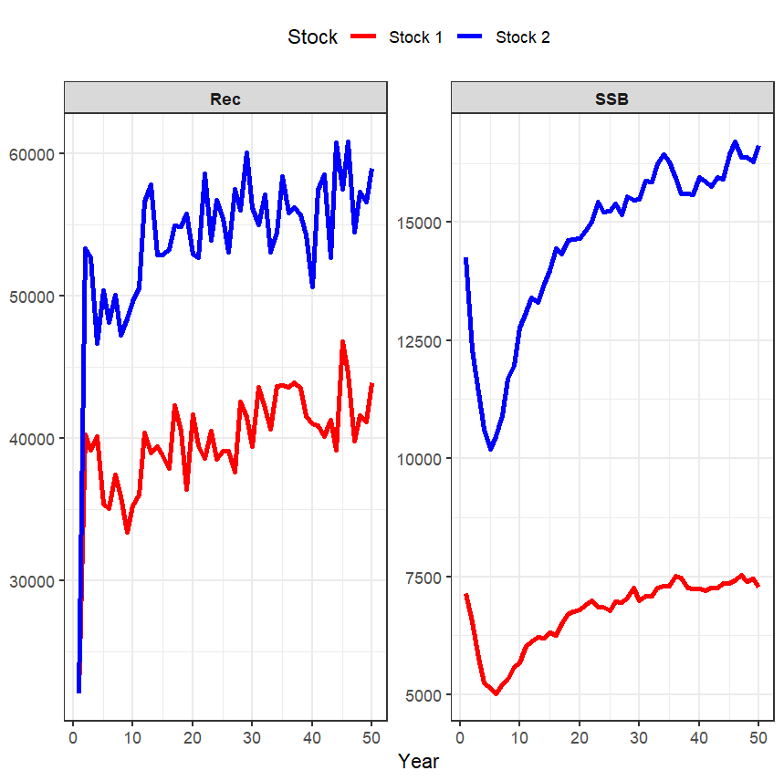

This vignette includes an example of how to specify metapopulation dynamics in multi-wham. Now the stocks are able to move to another region and contribute to the SSB during the spawning season (i.e. reproductive mixing).

### 1. Load "WHAM" and "SPASAM.MSE":

```{r, eval=FALSE}
library(wham)
library(SPASAM.MSE)

main.dir = here::here()
```

### 2. Generate basic information

```{r, eval=FALSE}
info <- generate_basic_info(base.years = 1:50, move_dyn = 1) # now stocks don't need to move back during the spawning season

basic_info = info$basic_info # collect basic information
catch_info = info$catch_info # collect fleet catch information
index_info = info$index_info # collect survey information
F_info = info$F # collect fishing information

# see more details using ?generate_basic_info
```

### 3. Specify movement type and movement rate

```{r, eval=FALSE}
basic_info <- generate_NAA_where(basic_info = basic_info, move.type = 2) # "bidirectional" movement

move <- generate_move(basic_info = basic_info, move.type = 2, move.rate = c(0.2,0.1), move.re = "constant")

```

### 4. Configure numbers-at-age (NAA)

```{r, eval=FALSE}

n_stocks  <- as.integer(basic_info['n_stocks'])
n_regions <- as.integer(basic_info['n_regions'])
n_fleets  <- as.integer(basic_info['n_fleets'])
n_indices <- as.integer(basic_info['n_indices'])
n_ages    <- as.integer(basic_info['n_ages'])

sigma        <- "rec+1"
re_cor       <- "iid"
ini.opt      <- "equilibrium" 
sigma_vals   <-  array(0.05, dim = c(n_stocks, n_regions, n_ages)) # Assume a low NAA sigma

# Set para. for B-H function
alpha <- 12
beta  <- 1.5e-4

NAA_re <- list(N1_model=rep(ini.opt,n_stocks),
               sigma=rep(sigma,n_stocks),
               cor=rep(re_cor,n_stocks),
               recruit_model = 3,
               recruit_pars = rep(list(c(alpha,beta)),n_stocks), # assume same B-H s-r functions for all stocks
               sigma_vals = sigma_vals) # NAA_where must be specified in basic_info!
```

### 5. Generate operating model and one realization

```{r, eval=FALSE}

input <- prepare_wham_input(basic_info = basic_info, NAA_re = NAA_re, move = move, 
                            catch_info = catch_info, index_info = index_info, F = F_info)
random = input$random # check what processes are random effects
input$random = NULL # so inner optimization won't change simulated RE
om <- fit_wham(input, do.fit = F, do.brps = T, MakeADFun.silent = TRUE)
# Note: do.fit must be FALSE (no modeling fitting yet)
set.seed(123)
input <- om$input
input$data <- om$simulate(complete=TRUE)
```

### 6. SSB and recruitment time series
```{r, eval=FALSE}
library(ggplot2)
library(dplyr)
library(tidyr)

yrs <- seq_len(dim(input$data$SSB)[1])

# Create dataframe
df <- data.frame(
  Year = yrs,
  SSB_stock1 = input$data$SSB[,1],
  SSB_stock2 = input$data$SSB[,2],
  Rec_stock1 = input$data$NAA[1,1,,1],
  Rec_stock2 = input$data$NAA[2,2,,1]
)

# Convert to long format
plot_df <- df |>
  pivot_longer(-Year) |>
  separate(name, into = c("Variable","Stock"), sep = "_")

plot_df$Stock <- factor(plot_df$Stock,
                        levels = c("stock1","stock2"),
                        labels = c("Stock 1","Stock 2"))

# Plot
ggplot(plot_df, aes(Year, value, color = Stock)) +
  geom_line(linewidth = 1.2) +
  facet_wrap(~Variable, scales = "free_y") +
  scale_color_manual(values = c("red","blue")) +
  labs(
    x = "Year",
    y = NULL
  ) +
  theme_bw() +
  theme(
    strip.text = element_text(face = "bold"),
    legend.position = "top"
  )
```
{width="600"}
